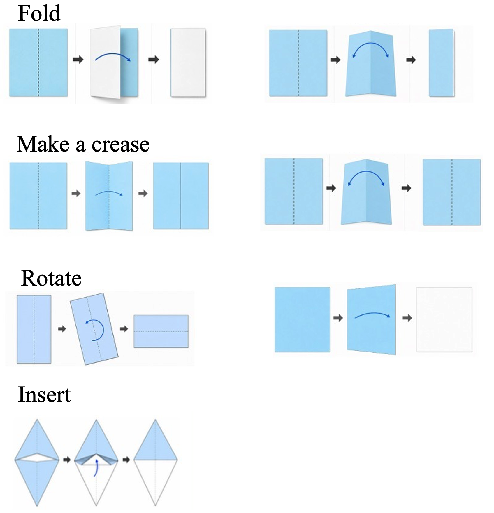

## Core Commands

- Fold
  https://github.com/jnszk/test_neurips_2026/blob/144bc73ed297c7c2e0bc99e5631a589af4c7af56/knowledge/command_specification.json#L147
  - Valley fold
  - Mountain fold
- Make a crease
  https://github.com/jnszk/test_neurips_2026/blob/144bc73ed297c7c2e0bc99e5631a589af4c7af56/knowledge/command_specification.json#L160
- Rotate
  https://github.com/jnszk/test_neurips_2026/blob/144bc73ed297c7c2e0bc99e5631a589af4c7af56/knowledge/command_specification.json#L207
- Insert
  https://github.com/jnszk/test_neurips_2026/blob/144bc73ed297c7c2e0bc99e5631a589af4c7af56/knowledge/command_specification.json#L173

## Examples of practical commands

- Pleat fold
- Accordion fold
- Blintz fold
- Kite fold
